# 区块链的技术
## 1 写在前面 (preface)
&nbsp;&nbsp;&nbsp;&nbsp;&nbsp;&nbsp;&nbsp;在2019年末，笔者终于将一年前自己写的关于区块链的学习笔记整理出来。

&nbsp;&nbsp;&nbsp;&nbsp;&nbsp;&nbsp;&nbsp;从2018年春季学期开学到2018年10月份，笔者对区块链产生了浓浓的好奇，于是查阅学习了各种白皮书、GitHub资源、Medium文章、Coursera网课等等诸多内容，对区块链从一概不知到有了一定的了解。在学习的过程中，笔者深感没有良好的区块链中文学习资源——要么通篇比喻和形象化描述，使得对区块链的讨论过于肤浅，要么是充斥各种术语十分不友好，要么就是英文文章的直接不通顺翻译。于是想着自己写一篇区块链的入门文章。一方面尽量使得语言通俗，使得阅读它所需要的前置知识尽可能得少，另一方面介绍尽量专业，使得读者有所“踏石留印”的收获，而并非只获得一些空洞的概念。

&nbsp;&nbsp;&nbsp;&nbsp;&nbsp;&nbsp;&nbsp;**本文只用于私下的学习和交流, 最终解释权归本人所有**。由于笔者自己对区块链的了解还不够全面和深入，因此文章内容必有错误、误解和偏激，希望读者不吝赐教！
## 2 目录 (contents)
1. [写在前面 (preface)](#写在前面)
2. [目录 (contents)](#目录)
3. [初识区块链 (an overview of blockchain)](#初识区块链)
	1. [哈希函数 (hash function)](#哈希函数)
	2. [共识算法 (consensus algorithm)](#共识算法)
	3. [数字签名 (digital signature)](#数字签名)
	4. [去中心化网络 (decentralized network)](#去中心化网络)
4. [区块链的进化过程 (the evolving history of blockchain)](#区块链的进化过程)
	1. [比特币——首个成功实现的加密货币 (Bitcoin--the first successful cryptocurrency)](#比特币——首个成功实现的加密货币)
		1. [比特币区块结构 (Bitcoin's block structure)](#比特币区块结构)
		2. [比特币共识算法 (Bitcoin's consensus algorithm)](#比特币共识算法)
		3. [比特币脚本与扩展应用 (Bitcoin script and extension)](#比特币脚本与扩展应用)
		4. [比特币与区块链1.0时代 (Bitcoin and the era of blockchain 1.0)](#比特币与区块链1.0时代)
	2. [以太坊——从交易系统到区块链平台 (Ethereum--from transaction system to blockchain platform)](#以太坊——从交易系统到区块链平台)
		1. [以太坊区块结构 (Ethereum's block structure)](#以太坊区块结构)
		2. [以太坊的运行 (how does Ethereum operate)](#以太坊的运行)
		3. [智能合约与去中心化应用 (smart contract and decentralized applications)](#智能合约与去中心化应用)
	3. [更多的探索 (more exploration)](#更多的探索)
5. [参考资料 (reference)](#参考资料)
6. [注记 (note)](#注记)

## 3 初识区块链 (an overview of blockchain)
&nbsp;&nbsp;&nbsp;&nbsp;&nbsp;&nbsp;&nbsp;区块链是一种新型的分布式数据库，由一个个基本的数据块——区块串联而成。相比于传统的数据库，区块链最大的不同在于其数据不是只有一个特殊的参与方（即所谓的“中心”）有权力负责收集、维护、整理和更新，所有参与者都有平等的权力完成这项工作（即所谓的“去中心化”）。一个区块链系统的所有数据面向全体参与者公开，单个参与者对数据库的任何行为必须得到全体成员[1](#myfootnote1)的认可才能生效。因此，一旦某数据经全体成员而写入区块链，篡改将变得极其困难，这极大地提高了区块链储存数据的安全性。
### 3.1 哈希函数 (hash function)
&nbsp;&nbsp;&nbsp;&nbsp;&nbsp;&nbsp;&nbsp;哈希（hash）函数并非是区块链独有的技术，但在区块链中起到极其重要的作用。区块链中的哈希函数是指这样的一个函数，它将一段任意长度的字符串作为输入值进行处理，生成一段固定长度的字符串（该字符串被称为原字符串的哈希值）。同时，这个函数还具有以下两大特点：

* 不存在两条不同的字符串，它们的哈希值相同。这里的“不存在”指统计意义上的不存在。事实上，由于哈希函数的输入值是任意长度而输出值却是固定长度，输入值的数量要远远超过可能的输出值的数量，必定存在不同的字符串使得它们的哈希值相同。但对于目前区块链领域所使用的哈希函数[2](#myfootnote2)，人们还没有找到这样的两条字符串，同时也没有找到可行的寻找方法。所以当我们发现两条字符串的哈希值相同时，由于这两条字符串不同的可能性微乎其微，我们有充足的把握认为这两条字符串相同。
* 已知某字符串的哈希值，不可能求出这个字符串（即哈希函数的不可逆性）。这里的“不可能”同样也不是指数学意义上的“不可能”，而是指目前人们还没有找出可行的求出方法或者逼近这段字符串的方法，只能通过类似穷举的方式一次次产生随机的字符串计算它的哈希值进行尝试。由于输入值是任意长度的，这将花费巨大的时间和计算资源，以至于在实践中根本不可行。同样，给定一个非常小的哈希值取值范围，我们只有通过大量的穷举试验，才最终有可能找到一段字符串使它的哈希值落在这个取值范围内。
               
&nbsp;&nbsp;&nbsp;&nbsp;&nbsp;&nbsp;&nbsp;哈希函数的这些特点，赋予了它很多的用处。比如我们要检查两块很大的数据是否相同，只需要检查它们的哈希值是否相同。又如我们只需要记住一块数据的哈希值就可以防止它被篡改。一旦这块数据被人篡改，它的哈希值也将随之变化，与我们手中的哈希值无法对应。

&nbsp;&nbsp;&nbsp;&nbsp;&nbsp;&nbsp;&nbsp;哈希函数承载着将一个个区块串联成链的工作。在区块链里，每一个区块都包含上一个区块的哈希值。因此若某人想篡改某一个区块的内容而不被发觉，就必须篡改下一个区块的内容，从而必须对这个区块之后的每一个区块进行篡改。所以我们只要记录好最后一个区块的内容，就可以对整个区块链所存储数据是否被篡改进行验证。

### 3.2 共识算法 (consensus algorithm)
&nbsp;&nbsp;&nbsp;&nbsp;&nbsp;&nbsp;&nbsp;设想在一个区块链网络中有一个特殊的参与者，他负责这些任务：

* 向每一个参与者提供当前区块链中储存的所有数据。
* 向每一个参与者提供当前区块链中储存的所有数据。

&nbsp;&nbsp;&nbsp;&nbsp;&nbsp;&nbsp;&nbsp;如果这个参与者是可靠的，那么这个区块链数据库就是可靠的：普通用户可以向该参与者提交新数据、查询旧数据；该参与者则主要负责区块链的维护和更新工作。事实上，这样的“区块链”在协作方式上和传统的数据库没有任何区别。他们都依赖于一个中心——一个特殊的负有“维护和更新数据库”责任的参与者，其他参与者直接和中心进行数据交流。

&nbsp;&nbsp;&nbsp;&nbsp;&nbsp;&nbsp;&nbsp;而在一个去中心化的网络里，完成数据库的维护和更新工作异常困难。在一个去中心化的网络里，没有那个负有特殊责任的参与者，网络中的所有参与者都可以收集大家发布的数据、在一个已经存在的区块之后连上打包成的新区块。这样从第一个区块（也成为“创世区块”）起每一个区块后将有若干区块相连，所有的区块共同构成区块树。我们需要一个算法让全体成员同意某一条从根区块到叶区块的路径其中所包含的数据作为历史数据。换句话说，从一个所有成员都认可的历史版本的数据库出发，不同的参与者对该数据库应该添加哪些数据意见不一，这些数据可能截然相反完全无法兼容。我们需要一个算法让全体成员对添加哪些数据达成共识。这就是一个区块链项目的核心——共识算法。[3](#myfootnote3)

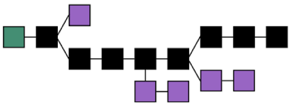

*区块树示意图*

&nbsp;&nbsp;&nbsp;&nbsp;&nbsp;&nbsp;&nbsp;自从中本聪第一次推出区块链的概念以来，区块链从业者相继发明了工作量证明机制（PoW）、权益证明机制（PoS）、股份授权证明机制（DPoS）等共识算法。这些共识算法各有不同，但总体来讲，都必须回答以下几个问题：

* 如何确保参与者制造符合要求、数据真实的区块？这个问题不难解决。由于整个网络去中心化，每个参与者都要检验他所接收到的新区快。不合法的区块无法被检验通过，自然不会被接受。因此每个参与者如果不想浪费时间和精力，必定选择制造合法区块。因此，本文后面关于共识算法的具体分析，不再讨论区块不合法的情况。
* 如何使全体成员对某个版本的数据库达成共识？这是一个共识算法关键解决的问题。
* 如何使全体成员达成共识的时间尽可能短？区块链出现暂时性分叉时，哪个版本的数据库为全体成员最终认可的版本尚无定论，用户自然不放心使用他所见到的数据库中的内容。也即，区块链的分叉现象不利于用户使用。一个成熟的共识算法应尽可能减少分叉现象的出现，保持数据库以一条区块链的形式不断延伸。
* 如何保持数据库的稳定？当全体成员改变共识，抛却当前主链而选择认可一条分叉链时，数据库部分内容会认为非法而遭到舍弃。这对使用这些被舍弃内容的用户带来不变，甚至有可能造成巨大经济损失。因此，一个成熟的共识算法必须维持全体成员共识的稳定，要在尽可能多的参与者“蓄意”分叉的情况下维持主链被大多数成员认可。

&nbsp;&nbsp;&nbsp;&nbsp;&nbsp;&nbsp;&nbsp;比特币作为第一个成功的区块链项目，采用工作量证明机制的共识算法。这种共识算法要求制造区块的人解决一个计算量巨大的难题来证明其制造区块过程中耗费大量精力。但这种共识算法因为计算量大耗费电能、数据更新速度低、容易被拥有更多计算资源的参与者控制等问题而被人诟病。

&nbsp;&nbsp;&nbsp;&nbsp;&nbsp;&nbsp;&nbsp;为解决工作量证明机制的种种问题，权益证明机制和股份授权证明机制分别被提出。这些共识算法的具体内容，将会在第二节具体叙述。

### 3.3 数字签名 (digital signature)
&nbsp;&nbsp;&nbsp;&nbsp;&nbsp;&nbsp;&nbsp;在真实世界里，为了确认某数据确实由某人授权，通常需要这个人在记录数据的公文上签名。其他人通过验证签名来确保数据的真实性。同样地，在虚拟世界里，数据的发布者也需要在数据上签署数字签名来方便他人验证数据的真实性。

&nbsp;&nbsp;&nbsp;&nbsp;&nbsp;&nbsp;&nbsp;数字签名和传统签名有相同之处。对于不同的签名人，无论所签的数据是否相同，数字签名必须不同。但二者又有区别。传统签名由于直接被签在对应的公文上，无法被拷贝伪造。而在虚拟世界里，所有的内容本质上都是一条字符串。别有用心的人完全可以拷贝下某条数据上的签名并附着于其他数据上以伪造签名。因此对于不同的数据，即使签名人相同，传统签名可以相同但数字签名必须不同。这是一个数字签名技术必须拥有的条件。

&nbsp;&nbsp;&nbsp;&nbsp;&nbsp;&nbsp;&nbsp;非对称加密算法就是用于解决这个问题。在非对称加密算法中，参与者可以通过一定的过程产生一对公钥和私钥，公钥作为区块链网络里自己的身份，被全网知晓。私钥则用于签名，需要保密。当参与者想发布一条数据时，可用私钥对这条数据加密得到数字签名，然后将数据与数字签名一同在全网广播。验证者通过数据发出者的公钥对数字签名进行解密，将解密的结果与接收到的数据相比对，如果相同则验证成功，如果不同则验证失败。对于想要伪造他人发布数据的人，由于他无法获得伪造对象的私钥，无法伪造对应的数字签名，因此他广播的数据将无法被验证自然不会得逞。

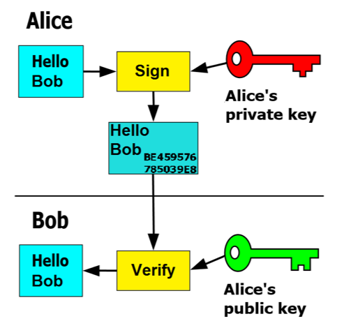

*数字签名示意图*

&nbsp;&nbsp;&nbsp;&nbsp;&nbsp;&nbsp;&nbsp;然而这里还有一个问题。当某人想发布一条很长的数据时，加密和解密的过程将变得十分复杂。现在通常采取的方法是，充分利用哈希函数输出值为固定长度的优势，数据发布者改为对数据的哈希值进行加密。验证者通过比对收到数据的哈希值和解密出来的哈希值是否相同，来判断该数据是否为真。

### 3.4 去中心化网络 (decentralized network)
&nbsp;&nbsp;&nbsp;&nbsp;&nbsp;&nbsp;&nbsp;区块链在一个去中心化的网络上运行，所谓去中心化的网络，即点对点网络，与传统的中心化网络结构完全不同。在传统的中心化网络结构里，有一个特殊的“中心”参与者。想要登陆到该网络的用户只需要和这个中心进行连接。中心化网络中的参与者若想要上传到数据库任何数据，只需要将数据告诉中心，由中心代为上传。如果他想获取当前的数据库内容，只需要向中心索取。而在去中心化的网络中，所有参与者人人平等，每个参与者只与其中一些参与者建立连接。去中心化的网络完成用户登陆、上传数据、查询数据的过程要复杂一些。

&nbsp;&nbsp;&nbsp;&nbsp;&nbsp;&nbsp;&nbsp;当一个新用户想要登陆到这个去中心化网络时，他只需要与已知的在登陆状态的其他用户建立连接。如果他想扩大自己连接的用户数量，可以向已连接的用户询问他们所连接的其他用户，再与那些用户进行连接。当他想上传一条数据时，需要向他已连接的其他用户广播这条数据。然后其他用户又会把这条数据广播给他们连接的用户。这样的过程持续下去，最终这个网络的想要制造区块的参与者都会接收到这条数据。而当他想获取当前数据库内容时，只需要询问与他连接的其他在线用户。

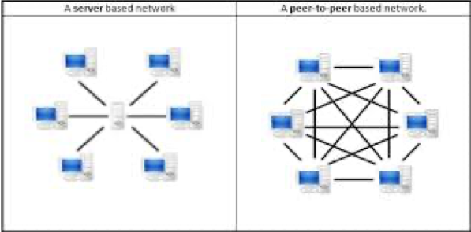

*中心化网络（左）和去中心化网络（右）示意图*

&nbsp;&nbsp;&nbsp;&nbsp;&nbsp;&nbsp;&nbsp;注意，参与去中心化网络的用户没有义务一定向他人代为广播数据（他也可以只接受数据而不向他人继续广播，甚至向他人广播虚假数据），也没有义务一定回答其他用户查询的要求（他可以闭口不言，也可以答非所问）。但由于这样做并不能给他带来任何直接利益，因此可以认为这样损人不利己的用户只占少数。只要每个用户连接到足够多其他的用户，那么他一定连接到足够多“行为正常”的用户，从而确保自己的行为不受干扰。

&nbsp;&nbsp;&nbsp;&nbsp;&nbsp;&nbsp;&nbsp;由此可见，去中心化网络的数据上传和查询效率比中心化网络相差许多。但是去中心化网络比中心化网络稳定、安全。中心化网络的运行严重依赖于中心的情况，中心承载着网络中所有数据的上传、查询工作，这要求中心的网络设备性能足够优秀。一旦中心的网络设备发生障碍，整个网络将面临瘫痪。此外，该网络的运行也严重依赖于中心处参与者的“道德水平”。一旦该参与者随意上传虚假数据，整个数据库将面临瘫痪。而在去中心化网络中，在任一小部分参与者“肆意破坏”或者他们的设备发生障碍的情况下，数据库仍然保持安全并正常更新。这是去中心化网络无可比拟的优点。

## 4 区块链的进化过程 (the evolving history of blockchain)
### 4.1 比特币——首个成功实现的加密货币 (Bitcoin--the first successful cryptocurrency)
&nbsp;&nbsp;&nbsp;&nbsp;&nbsp;&nbsp;&nbsp;早期的区块链项目以加密货币交易系统的形式存在。这种情况下，区块链作为一种加密货币的交易记账本，记录着每一个账户拥有的加密货币资产和历史交易记录。比特币是公认的最早的具有实践意义的加密货币，也是目前为止最被认可的加密货币。本节将以比特币为例，介绍早期的区块链项目。

#### 4.1.1 比特币区块结构 (Bitcoin's block structure)
&nbsp;&nbsp;&nbsp;&nbsp;&nbsp;&nbsp;&nbsp;比特币区块由区块头和主体数据两大部分组成。区块头作为这个区块的概要，由上一个区块的区块头的哈希值Prev Hash、本区块的时间戳Timestamp（可通俗理解为本区块被制造的时刻）、Merkle Root和一个nonce值四部分组成。Merkle Root作为本区块数据部分的概要，具体含义将在后文说明。nonce值没有特殊意义，只是出于共识算法需要而存在，具体用处也将在后文说明。由哈希函数的特点，一个区块即使包含的数据相同，所连接的上一个区块不同则内容不同。

&nbsp;&nbsp;&nbsp;&nbsp;&nbsp;&nbsp;&nbsp;比特币区块的主体数据区域，记录着上一个区块和本区块产生时刻之间（平均来讲是十分钟）的比特币交易数据[4](#myfootnote4)。考虑到十分钟内产生的交易数据十分巨大，必须采用一种合理的数据结构记录它们。比特币交易系统采用Merkle Tree的数据结构来记录这些交易数据。建立一棵Merkle Tree记录交易数据的过程如下所述：首先计算出所有交易数据的哈希值，然后将所有的哈希值排成一行，相邻两项进行配对。然后将两两配对的哈希值对作为一个整体，计算它们的哈希值，这样得到了数量原先一半的若干哈希值。然后再将这些哈希值两两配对，计算每一对的哈希值。重复上述过程，最终剩下一个哈希值，即为区块头中的Merkle Root（也即下图的Top Hash）。

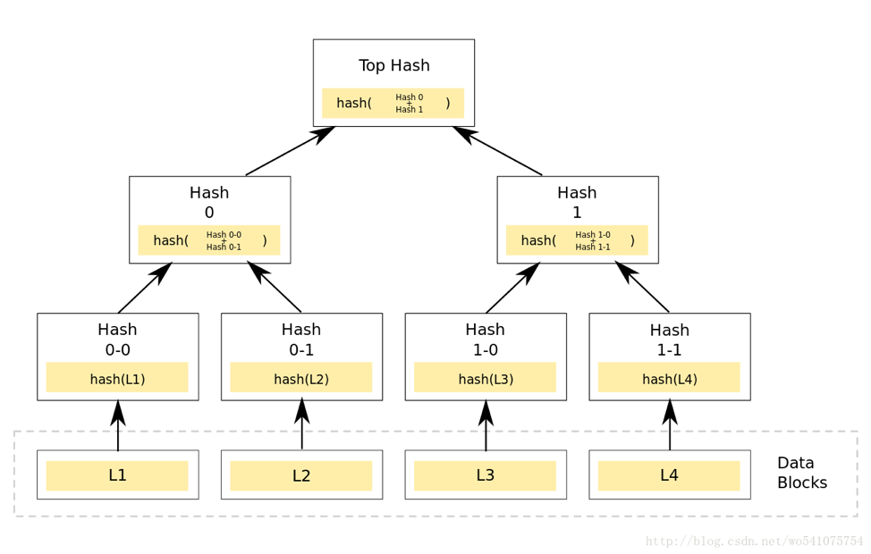

*Merkle Tree数据结构示意图*

&nbsp;&nbsp;&nbsp;&nbsp;&nbsp;&nbsp;&nbsp;由哈希函数的特点可知，只要Merkle Tree底部某一条数据被篡改（如图中L2），那么从这条数据沿路向上的所有哈希值都需要修改（如图中Hash0-1、Hash0和Top hash），最终需要Top hash被修改。因此如果记录好这棵树的Top hash，就保证整棵树储存的所有数据不被篡改。同时，由于某一条数据修改导致沿路的所有哈希值都会发生改动，便可以从Top hash沿着一路发生改动的哈希值快速定位到被修改的数据，大大提高了寻找被修改数据的效率。

&nbsp;&nbsp;&nbsp;&nbsp;&nbsp;&nbsp;&nbsp;用Merkle Tree存储数据还有其他好处。当给定一棵Merkle Tree的Top hash值和一条数据时，只要能够提供从这条数据沿路向上的所有哈希值和每一个哈希值产生时所必备的另一条数据，只要最后得到的哈希值与Top hash值相等，便说明该数据储存在这棵树中，而无需提供这棵树的所有数据。如下图所示，为了证明中间区块记录有Tx3交易数据，只需提供沿路向上的所有哈希值Hash3、Hash23、Merkle Root和产生它们必备的Hash2、Hash01，只要其中所有的哈希运算都正确，那么Tx3必定被记录在内。

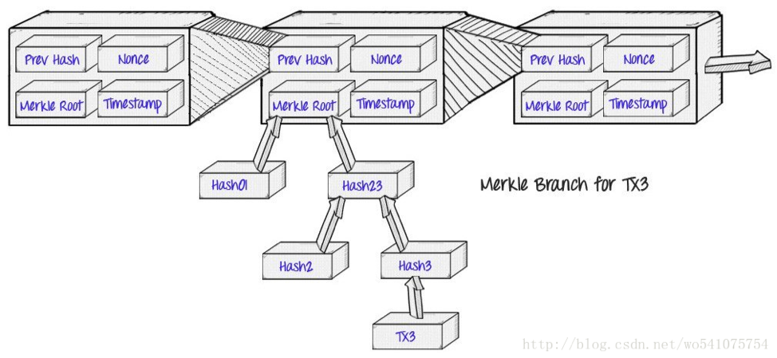

*简化的比特币区块链示意图*

&nbsp;&nbsp;&nbsp;&nbsp;&nbsp;&nbsp;&nbsp;同时，在建立Merkle Tree时，如果将所有数据按照一定的顺序（如按照字母表顺序）排成一行，那么对于给定的一条数据A，只要我们能出示两条在二叉树中紧邻的数据，且其中一条数据顺序先于A，另一条数据顺序后于A，那么就能够证明这条数据不在这棵Merkle Tree中。

&nbsp;&nbsp;&nbsp;&nbsp;&nbsp;&nbsp;&nbsp;每一条交易数据大体上讲，由若干条输入数据和若干条输出数据组成。输入数据记录有多少比特币转出账户，输出数据记录有多少比特币转入哪个账户。每一条交易数据拥有的多条输入数据、输出数据，表示一次交易活动由若干个账户向其他若干账户共同转账完成。每一条输出数据都包含一个数值（即一定数量的比特币）和一个账户地址（即收款人的公钥）。而每一条输入数据都会引用一个已经被记录的一条交易数据中的一条输出，表示那条输出对应的比特币金额将会被转出对应的账户。同时每一条输入数据还需要附上对应的转出比特币的账户关于本条交易数据的数字签名，来保证这次交易活动确实由账户所有者授权。

&nbsp;&nbsp;&nbsp;&nbsp;&nbsp;&nbsp;&nbsp;由此可见，比特币区块并没有直接记录每一个账户的余额，而是直接记录每一条交易数据。对于一个特定的账户，在某一个特定区块之前拥有多少比特币，取决于从第一个区块（也成为“创世区块”）到这个区块之间所有没有被某条输入数据引用的向这个账户地址转账的输出数据。换句话说，比特币交易系统中并没有独立的“比特币”的概念，只有未被引用的交易输出。一个账户拥有多少未被引用的交易输出，再对每一个这样的输出含有的数值求和，就拥有多少比特币。若验证某条交易数据是否合法，只需要验证三点：第一，对于该条交易数据包含的每一条输入数据，找到它引用的输出数据，从该输出数据所在的区块到当前区块之间没有其他输入数据引用那条输出数据[5](#myfootnote5)；第二，每一条输入数据包含的数字签名真实；第三，所有输入数据引用的输出数据记录的比特币数量之和不少于所有输出数据的比特币数量之和。可能多余的比特币的用途将在下一节叙述。
#### 4.1.2 比特币共识算法 (Bitcoin's consensus algorithm)

&nbsp;&nbsp;&nbsp;&nbsp;&nbsp;&nbsp;&nbsp;比特币采用PoW工作量证明机制，来使全网络的参与者对比特币历史交易数据达成共识。其具体内容如下所述：

* 一个合法的区块除了要求其数据部分的交易数据真实合法之外，其区块头的nonce值也必须合适，使得区块头整体的哈希值小于一个给定的阈值。
* 全体成员认可的区块的制造者，将会受到一定数量的比特币奖励。该奖励机制如下所述：该参与者需要在制造的区块中写入一条特殊的交易数据。这条交易数据的输入部分不引用任何之前的输出数据，输出部分为将一定数量的比特币转账给该参与者指定的账户地址（显然一般情况下该参与者会把比特币转账给自己的账户地址）。这一定数量的比特币奖励由两部分组成，第一部分数量固定，每隔210,000个区块（约四年）减半，当前值为12.5。第二部分为这个区块记录的所有交易数据中“多余”的比特币数量的总和，即交易数据中可能“多余”的比特币将作为交易费用支付给把这条数据写入区块链的人。
* 当区块链出现分叉时，最长链（即拥有区块数量最多的链）为合法链，最长链储存的数据内容被认为是合法内容。

&nbsp;&nbsp;&nbsp;&nbsp;&nbsp;&nbsp;&nbsp;在第二条的激励下，易见会有很多参与者试图收集新的交易数据，制造新的区块（这些参与者被称为“矿工”，而试图制造新区块的行为被称为“挖矿”）。这使得区块链的记账权去中心化，不被某个特殊个体垄断。然而区块中用于奖励的交易数据只有被全体成员认可才合法。由第三条知矿工会选择在最长链上制造区块，来使全体成员认可他的区块的可能性最高。

&nbsp;&nbsp;&nbsp;&nbsp;&nbsp;&nbsp;&nbsp;为了使得全体成员迅速达成共识，我们需要提高制造区块的难度。这样当一个矿工在某区块A后正在制造一个新的区块B却发现B后已连有其他区块C时，他知道其他矿工已经在C后继续制造区块，此时即使他将B成功制造出来，因为大多数矿工从C往后挖矿，C比B集中了更多的算力，从A由B出发的分叉链的长度大概率无法超过从A由C出发的分叉链的长度，所以他继续制造只是在浪费精力。那么理性的矿工必然会放弃当前B的制造工作转而从C往后制造区块。由上述分析可知，第三条内容的另一个表述是集中全网络算力最高的链为合法链，或者更进一步，凝聚全网络更高认可度的分叉链为合法链。

&nbsp;&nbsp;&nbsp;&nbsp;&nbsp;&nbsp;&nbsp;第一条便是为了提高制造区块的难度。由哈希函数的不可逆性知，为了制造出合法的区块，矿工只得采用穷举的方式，一遍一遍随机试探nonce值，直到整个区块头的哈希值小于给定的阈值。这个过程由于穷举的空间过于庞大，矿工必须耗费一定的时间和大量的算力，使得制造区块的速度大大下降。当有若干分叉链存在时，每一个矿工由于算力有限，必定只选择在一个分叉链上延伸[6](#myfootnote6)。因此理性的矿工必定选择在最长链上制造区块。最长链势必拥有全网络大多数算力延伸自己，比其他链延伸速度快许多，使得全体成员迅速对认可这条链的数据内容达成共识。

&nbsp;&nbsp;&nbsp;&nbsp;&nbsp;&nbsp;&nbsp;当某个参与者试图篡改数据库内容，改变全体成员共识时，他需要在这个区块之前另开出一条分叉并让这个分叉链的长度超过主链。由于主链集中了全网绝大多数算力，主链延伸速度势必比这条分叉链快。主链比分叉链越长，该参与者让分叉链长度超过主链的难度越大。实际研究表明，当一个区块后已经有5-6个区块依次相连时，从这个区块之前开出分叉链并使他的长度超过主链的概率已接近于零，这个区块的数据已足够安全。

&nbsp;&nbsp;&nbsp;&nbsp;&nbsp;&nbsp;&nbsp;在保证区块链数据的安全的前提下，为了提高效率，制造区块的难度又不可过大。事实上，第一条中的阈值会根据区块链延伸速度每隔2016个区块调整一次，使得在一个较长的时间跨度内区块链平均每十分钟延伸一个区块。

&nbsp;&nbsp;&nbsp;&nbsp;&nbsp;&nbsp;&nbsp;比特币共识算法中对制造区块奖励的规定也十分巧妙。当前交易费用很低，制造区块的奖励主要来源于那一部分固定数额。这一部分在比特币交易系统中扮演着“分发新币、维持比特币适度通货膨胀”的功能。而该部分每隔约四年数量减半，使得比特币的总量存在上限，这维持了比特币的稀缺性，维护了它的价值。当固定部分的数量越来越少时，易见交易费用将会提高。未来制造区块的奖励将主要由交易费用提供。

#### 4.1.3 比特币脚本与扩展应用 (Bitcoin script and extension)
&nbsp;&nbsp;&nbsp;&nbsp;&nbsp;&nbsp;&nbsp;由前一节所述，一个账户拥有的比特币实际上是以“未被引用的交易输出”的形式存在的。事实上，“未被引用的交易输出”不仅可以被一个账户所控制，更可以被一个更为复杂的“条件”所控制。在前者情况下，为了取回被某个账户控制的比特币，参与者需要提供由该账户私钥签下的数字签名。相似地，在后者情况下，为了取回被“条件”控制的比特币，参与者需要提供需要满足的条件。二者都是只有满足所引用的交易输出的某个要求之后才能获得相应的比特币，本质并无不同。

&nbsp;&nbsp;&nbsp;&nbsp;&nbsp;&nbsp;&nbsp;为了实现上述更广泛的功能，比特币区块的每一条交易数据，都用一种只含有命令和数据的脚本语言写成，即比特币脚本。交易数据的输出数据被称为锁定脚本，它用比特币脚本表示为了引用这条输出数据，参与者需要提供的条件；每一条输入数据被称为解锁脚本，提供所引用的输出数据要求的条件。输出数据中转入比特币账户的数字签名就是通常情况下需要提供的条件。事实上，你可以在输出数据中表示任何能用比特币脚本表示的条件，甚至如提供一个数学问题的答案。当某个参与者广播了一条输入数据中用比特币脚本提供了正确答案的交易数据，并且这条数据被记入区块链时，它便成功获得你的输出数据包含的那笔比特币。为了验证某一条交易数据，只需要运行它每一条解锁脚本而不需要考虑其锁定脚本，如果每一条解锁脚本都顺利通过，则交易数据合法。[7](#myfootnote7)

&nbsp;&nbsp;&nbsp;&nbsp;&nbsp;&nbsp;&nbsp;充分利用比特币脚本，可以得到很多有趣且有效的应用。比如比特币脚本可以实现多重签名条件，即指定n个账户地址（公钥）和一个参数t，参与者只有在这n个账户中同时至少提供t个不同的数字签名才可以获得对应数量的比特币。多重签名条件可以应用在实际的“钱物交易”中：例如A广播一条普通的交易数据来支付一定数额的比特币向网店B购买某种商品，由于交易数据一旦被区块链记录将无法篡改，如果B向A快递一件次品或者拒绝发货，A将无法取回已支付的比特币。在这种情况下，A可以运用多重签名广播一条特殊的交易数据，这条交易数据将商品价格对应的比特币数目从自己账户转出，输出数据指定了A、B和另一位仲裁者C三位的账户地址，并要求只有提供其中至少两个数字签名才能获得对应的比特币。B在确认这条交易数据被区块链记录且无法篡改后发货。如果A收到商品后感觉满意同意付款，可以和B一起制造一条交易数据，将刚才那笔比特币支付给B。如果A收到商品后不满意且B愿意退款，A、B可以一起制造一条交易数据将比特币返还给A。如果A、B产生争执，可以由C进行仲裁，C和仲裁胜利的那一方一起制造一条交易数据，将刚才那笔比特币支付给仲裁胜利的一方。

&nbsp;&nbsp;&nbsp;&nbsp;&nbsp;&nbsp;&nbsp;运用比特币脚本，你甚至可以在区块链中记下你任何想记录的内容。比特币脚本中有一条特殊的命令OP_RETURN，当运行到这条命令时，验证工作将提前以解锁失败的状态结束，不再执行之后的语句。这使得包含这条命令的锁定脚本将永远无法被解锁。这样，我们就可以发起一笔数额很小的交易数据，其输出数据之一包含OP_RETURN，我们就可以在这个命令之后的区域（又称为元数据区域）写入任何想记录的内容。事实上，利用这一命令，有人在比特币区块上表白求爱，有人许下心愿，有人记录了各种数据的哈希值……TD Ameritrade公司甚至广播了68条交易数据，在比特币区块链上拼出了一个带有该公司logo的数字旗帜！

&nbsp;&nbsp;&nbsp;&nbsp;&nbsp;&nbsp;&nbsp;利用元数据区域在比特币区块链上存储任何数据，成为比特币区块链功能扩展的重要技术支持。在这一区域，很多参与者自行创立数字资产，完成它们的发行和转移工作。Omni Layer和Counterparty为这一领域的著名平台，著名的泰达币（Tether）便是Omni Layer的杰出产品。另外，结合区块链数据的不可篡改性，Factom和Bitproof两大项目在这一区域提供文档记录和管理功能。事实上，著名的区块链2.0项目以太坊最初也考虑在这一区域建立。元数据区域为比特币区块链进行应用扩展提供了广阔的想象空间。

&nbsp;&nbsp;&nbsp;&nbsp;&nbsp;&nbsp;&nbsp;然而，由于在这一区域的项目的规则，并不是比特币交易系统的规则，它们无法阻止矿工记录对于比特币交易系统合法、但对于项目不合法的交易数据。因此，这些项目通常需要扫描从比特币区块链头部一直到末尾所有的元数据区域，来决定某一条交易数据对于它们是否合法。这样的工作过于繁琐，普通用户难以完成。因此一般来讲，在元数据区域实现的都是轻应用项目。而且它们都依靠一个值得信任的第三方专门进行这样工作。而这又与区块链项目解决信任问题的初衷相违背。

#### 4.1.4 比特币与区块链1.0时代 (Bitcoin and the era of blockchain 1.0)
&nbsp;&nbsp;&nbsp;&nbsp;&nbsp;&nbsp;&nbsp;2008年，当中本聪首次发表《比特币：一种点对点的电子现金系统》的论文的时候，他设想通过比特币打造一个无约束、便捷、安全的交易系统。而发展到如今的比特币交易系统和中本聪当年的愿景似乎有不少差异。

&nbsp;&nbsp;&nbsp;&nbsp;&nbsp;&nbsp;&nbsp;首先在学界，比特币的“货币”身份仍遭到质疑。传统货币由主权国家背书，价值来源于人们对主权国家的认同。而当前比特币交易系统的支付功能并没有普及，比特币价值来源于人们对于未来应用价值的预期。而未来的应用价值难以估计且易被炒作，因此可以看到，比特币吸引了大量投机需求，其价格经常发生大幅度波动。这与货币的价格应保持稳定的要求相违背。

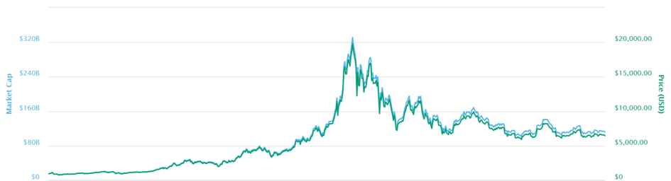

*比特币从2017年年初到2018年10月的价格和市值*

&nbsp;&nbsp;&nbsp;&nbsp;&nbsp;&nbsp;&nbsp;其次，比特币的交易速度欠佳。通常比特币网络中的新区块只有后面连接了5-6个区块后才被认为无法篡改，按照比特币区块链平均十分钟产生一个新区块来估计，一条交易数据被广播后至少要等到约一个小时的时间才能被确认交易成功。而且这还没有考虑交易拥堵的问题。由于比特币区块有上限1M的大小限制，1秒钟平均只有七条交易数据被记录在区块链中。在广播交易数据的高峰时期，有超过10万条交易数据等待被记录，这对于使用比特币交易的用户无疑是一种灾难。在区块链上记录交易数据的不便，使得当前大多数比特币交易行为在“中心化”的交易所完成。在这些交易所中，用户买到的比特币并不能在区块链上查到，本质上是交易所对用户一定数量比特币的“欠条”。所以在交易所中买卖双方交易的比特币的本质是交易所的“欠条”。易知这样的交易行为与区块链脱离，其安全性严重依赖于交易所的信誉，这与比特币解决信任问题的初衷背道而驰。

&nbsp;&nbsp;&nbsp;&nbsp;&nbsp;&nbsp;&nbsp;同时，由于近年来比特币价格不断走高，越来越多的人加入了矿工的行列，这使得挖矿的难度逐渐加大。而挖矿难度的加大必然导致挖矿的成本（寻找合适nonce值的电费）的抬升。为了能有更大的几率挖到新的区块，有实力的矿工竞相购置挖矿专用的矿机，在电费便宜之处开办大型矿场。而实力相对较弱的矿工则因无法负担高额的挖矿成本而退出竞争。这使得挖矿行业逐渐被几大巨头垄断。而记账权被垄断与比特币去中心化的初衷相违背。由下图可知算力排名靠前的几大矿池的算力之和已超过全网算力的一半，如果联手，可以轻易分叉一条长度超过主链的分叉链，从而轻松改变比特币网络的共识。

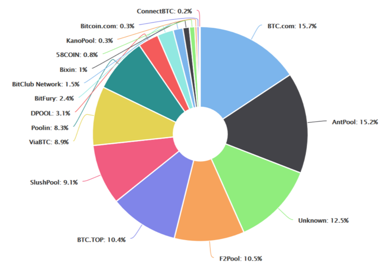

*比特币全网算力分布*

&nbsp;&nbsp;&nbsp;&nbsp;&nbsp;&nbsp;&nbsp;算力的垄断也意味着在比特币开发社区话语权的垄断。比特币社区一直对解决比特币交易拥堵的扩容方案争论不休。一派希望提高技术，通过隔离见证（Segwit）再进行闪电网络（Lightning Network）的方法间接实现扩容；而另一派则希望提高区块大小上限来直接实现扩容。而比特大陆作为世界最大的矿机生产商，直接或间接对BTC.com、AntPool、BTC.TOP和ViaBTC等矿池拥有一定的控制力。合计算力超过全网一半的他们支持直接扩容方案，在与另一派矛盾激化后，决定直接运用直接扩容的方案挖矿。由于该方案和比特币交易系统原本的规则并不兼容，导致比特币区块链被硬分叉出了一条新链，这就是比特币现金（Bitcoin Cash）的诞生。这场硬分叉事件反映比特币规则升级的话语权一直在开发团队和大矿主手里，而普通用户根本没有发言权。但普通用户却白白承担着硬分叉导致的比特币价格大跌的损失，这样的现状也与比特币去中心化的初衷相违。

&nbsp;&nbsp;&nbsp;&nbsp;&nbsp;&nbsp;&nbsp;新事物未必能做到尽善尽美，出现即是胜利。比特币交易系统尽管在许多方面遭人诟病，仍是人类在协作方式上的一项重大革新，在很大程度上实现了去中心化的交易诉求。在比特币交易系统创立之后，针对比特币的缺陷，又出现了莱特币（Litecoin）、瑞波币（Ripple）、点点币（Peercoin）、门罗币（Monero）等区块链项目。这些项目虽与比特币有大大小小的差别，但都专注于实现去中心化的加密货币交易系统。这一类型的区块链项目，被广泛称为区块链1.0。

### 4.2 以太坊——从交易系统到区块链平台 (Ethereum--from transaction system to blockchain platform)
&nbsp;&nbsp;&nbsp;&nbsp;&nbsp;&nbsp;&nbsp;在早期的区块链1.0时代，区块链基于一定的共识算法，服务于加密货币交易。然而，由前面章节可见，区块链并非天生服务于加密货币。反之，只要设计好共识算法，只要在底层设计好一种加密货币作为奖励鼓励人们积极诚实记录数据，区块链更可作为一般性的去中心化架构的数据库，使得人们可以用去中心化的协作方式做任何事。年轻的俄罗斯天才少年维塔利克·布特林（Vitalik·Buterin）受此启发，创立了著名的区块链项目——以太坊。以太坊的创立，标志着区块链从专注于解决交易问题，开始尝试实现用户自定义的去中心化服务。这一阶段的区块链项目，被称为区块链2.0。本节将以以太坊为例，介绍2.0时期的区块链项目。

#### 4.2.1 以太坊区块结构 (Ethereum's block structure)
&nbsp;&nbsp;&nbsp;&nbsp;&nbsp;&nbsp;&nbsp;回顾比特币交易系统，比特币区块链的不断延伸，从概念上来讲是以下一件事情：从创世区块到任意给定的某区块之间的所有数据，记录了在那个区块被制造成功的时间点上整个系统的状态，即所有账户和它们的账户余额。区块链每延长一个区块，代表着制造那个区块的矿工对整个系统的状态做了一次更新，即依据区块内部的交易数据，扣除和添加相应转入、转出账户的余额。

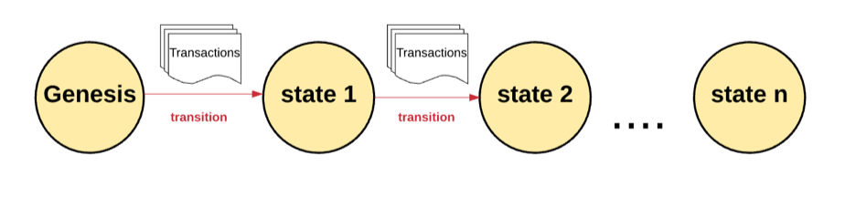

*基于一定交易数据（区块）的状态转移示意图*

&nbsp;&nbsp;&nbsp;&nbsp;&nbsp;&nbsp;&nbsp;给定一个初始状态（创世区块）和若干条交易数据（状态转移过程），我们可以推算出经过这些交易数据后系统的状态。在比特币交易系统中，由于状态转移过程十分简单，我们省却了在区块中记录系统状态。而当实现以太坊时，由于参与者可以对系统状态进行任意合法的改变，状态转移十分复杂，我们不能省略任何具体信息。

&nbsp;&nbsp;&nbsp;&nbsp;&nbsp;&nbsp;&nbsp;通过上述分析，我们得知在以太坊区块中，我们不仅需要记录一段时间内发生的所有交易数据[8](#myfootnote8)，还要记录根据这些交易数据改变系统状态过程中的过程信息和系统的最终状态。具体来说，以太坊区块也由区块头和数据主体两部分组成。区块头作为整个区块的概要，与比特币区块头大体相似，最大的不同在于用stateRoot、transactionsRoot和receiptsRoot三个值作为区块主体数据的概要。这三个值的含义将在后文说明。

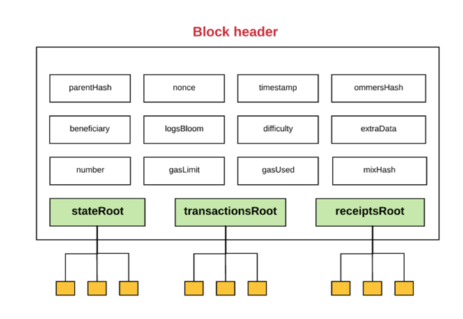

*以太坊区块头示意图*

&nbsp;&nbsp;&nbsp;&nbsp;&nbsp;&nbsp;&nbsp;以太坊区块的主体部分，记录了一段时间内的交易数据，对应的交易收据[9](#myfootnote9)和系统（所有账户）的最终状态。以太坊通过三棵改良Merkle Tree的数据结构，Merkle Patricia Tree分别记录以上三项内容。其根节点的哈希值即为上文提到的transactionsRoot、receiptsRoot和stateRoot。Merkle Patricia Tree继承了Merkle Tree的优势，而且特别方便数据的删除、查找、更新和还原，方便系统状态的更新。

&nbsp;&nbsp;&nbsp;&nbsp;&nbsp;&nbsp;&nbsp;在以太坊中，账户分为两种类型，一种是被外部参与者通过私钥控制的账户，与比特币交易系统中的账户类似，另一种是通过代码控制的合约账户。合约账户是以太坊实现一般性去中心化应用的重要发明。从概念上，它与外部参与者控制的账户地位平等，内部也存储一定数据，也拥有一定数量的以太币。不同的是，外部账户可以主动发起交易，主动与其他账户交互（下文将“与其他账户交互”称为呼叫其他账户）。而合约账户无法发起交易，但可以对其他账户的呼叫根据代码进行任何预先指定好的回应，如变更自身存储的数据、呼叫其他账户、创建新的合约账户、回答信息。参与者想实现的复杂操作，绝大部分由合约账户承担。参与者只需要发起一条适当的交易数据，呼叫对应的合约账户执行任务即可。

&nbsp;&nbsp;&nbsp;&nbsp;&nbsp;&nbsp;&nbsp;在以太坊区块中，每一个账户都由以下四部分组成：

* **nonce**：这是为了防止某条交易数据被矿工执行多次而设定的值，对于外部账户，其大小等于从这个账户发出的交易数据的数量，对于合约账户，其大小等于其建立其他合约账户的次数。
* **balance**：这个值是账户余额，记录了该账户名下的以太币数量。
* **storageRoot**：这是该账户内部存储的数据的概要，每一个账户内的存储数据由一棵Merkle Patricia Tree记录，storageRoot是这棵树根节点的哈希值。
* **codehash**：当该账户是合约账户时，该值是控制该账户的代码的哈希值；当该账户是外部参与者控制的账户时，该值为一个空字符串的哈希值，没有意义。

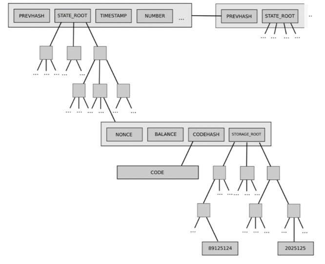

*以太坊区块链结构示意图*

#### 4.2.2 以太坊的运行 (how does Ethereum operate)
&nbsp;&nbsp;&nbsp;&nbsp;&nbsp;&nbsp;&nbsp;以太坊究竟是什么？虽然在2.2节的开头我们便指出，以太坊是一个一般性的去中心化架构的区块链，使参与者可以以去中心化的协作方式完成任何工作。虽然这个定义很学术化，但并没有帮助我们接近以太坊的本质。

&nbsp;&nbsp;&nbsp;&nbsp;&nbsp;&nbsp;&nbsp;以太坊可以理解为一个去中心化的云服务器，一个个矿工是它去中心化的服务商。他们在本地储存了以太坊的所有数据，以竞争性的关系利用本地的计算机[10](#myfootnote10)为以太坊的使用者提供各种服务。用户通过外部账户在以太坊网络里广播需求（交易数据），矿工收到需求后，根据需求呼叫相关账户，并进行更改账户内部存储的数据、运行被呼叫的合约账户的代码、呼叫其他账户等工作。第一个完成用户需求的矿工将更新后的所有数据在以太坊全网广播。用户通过以太币向该矿工支付服务费用。下面将具体介绍以太坊的运行过程。

&nbsp;&nbsp;&nbsp;&nbsp;&nbsp;&nbsp;&nbsp;首先介绍以太坊交易数据的结构。交易数据按功能可分为发送消息和建立合约账户两种类型。它们都由以下几部分组成：

* **nonce**：一个防止矿工将这条交易执行多次而设定的数值，其大小必须等于发起账户的nonce值，如果不相等则为非法交易。
* **gasPrice**、**gasLimit**：这是发起账户自行设定的两个值，为了确定矿工提供根据交易改变系统状态的服务，账户需要支付的交易费用，并防止矿工在改变系统状态时操作次数过大或进入无限循环。gasPrice是矿工在改变系统状态过程中，每一次操作需要的发起账户支付的金额。gasLimit是操作次数的上限，包括使被呼叫的合约账户根据内部代码回应过程中发生的一切操作次数。矿工如果在操作中途操作次数超过了gasLimit，便会把该交易数据引发的系统的一切变化复原，但发起账户仍要支付矿工已经进行的操作次数对应的费用。这两个值有效防止“恶性的”交易数据通过命令矿工执行过大的操作任务，耗时过长导致以太坊瘫痪。
* **to**：它记录了交易数据指定的要呼叫的帐户的地址。对于建立合约账户的交易数据，这个值为空。
* **value**：它是发起账户想要转账给被呼叫账户的以太币金额。
* **v**、**r**、**s**：它们一起记录了发起账户关于本次交易数据的数字签名和地址。

&nbsp;&nbsp;&nbsp;&nbsp;&nbsp;&nbsp;&nbsp;此外，一个建立合约账户的交易数据还包括一个init部分。这是一串为了建立合约账户矿工要运行的代码。发送消息的交易数据还可以有选择地包含一个data部分。我们可以把合约账户看成一个函数，有些函数在被调用的时候需要提供输入值，data就是提供的输入值。

&nbsp;&nbsp;&nbsp;&nbsp;&nbsp;&nbsp;&nbsp;除了交易之外，以太坊还有一个相似的概念——消息。消息在发起账户和被呼叫的账户之间传递，由data和value两部分组成，其含义和上文交易数据的data和value的含义相同。事实上，发送消息的交易数据本质上就是一条消息。消息不仅可被外部账户发送，更可被回应呼叫的合约账户根据代码发送给指定的账户。

&nbsp;&nbsp;&nbsp;&nbsp;&nbsp;&nbsp;&nbsp;当矿工接收到用户广播的交易数据后，先验证交易数据的合法性。然后矿工便根据交易数据改变系统的状态：首先将gasLimit乘gasPrice数量的以太币从发起账户转账到矿工自己的账户，并将发起账户的nonce值加一。然后，如果是建立合约的交易数据，便根据交易数据建立对应的合约账户，并把value对应的以太币转给合约账户。如果是发送消息的交易，首先将value对应的以太币转账给被呼叫的账户，如果被呼叫的账户是合约账户就运行它的代码，进行代码所命令的操作，直到结束或者累计运算次数超过gasLimit。如果正常结束，矿工再将还能进行的操作次数对应的以太币从自己的账户转账回去，如果中途操作次数超过gasLimit，则将所有对系统状态的变化复原，但仍保留交易费用。在整个过程中，矿工还需要记录交易收据。这样执行若干交易数据后，矿工将执行过的交易数据、产生的交易收据和系统最终的状态数据打包成一个区块，并再向自己的账户增加一个固定数量的以太币（当前为三个以太币）作为制造区块的酬劳。然后将区块在全网广播，完成系统状态的更新。

&nbsp;&nbsp;&nbsp;&nbsp;&nbsp;&nbsp;&nbsp;以太坊采用与比特币交易系统相似的工作量证明机制使全网对系统状态的更新达成共识。但具体实现又有所不同：

* 以太坊改变了寻找nonce值的方法。比特币交易系统寻找合适nonce值的方法为穷举。人们利用其穷举是大量重复相同工作的本质，开发专门的ASIC挖矿芯片提升运算效率。这使得全网的挖矿算力逐渐向有钱的人集中。而在以太坊，寻找nonce值的过程相对复杂。以太坊希望借此避免他人开发专门的挖矿工具，使得人人均可用普通计算机挖矿。
* 以太坊提高了区块链延伸的速度。以太坊区块链每延伸一个区块就进行一次难度调整，使得平均每十五秒延伸一个区块。然而，相对较低的挖矿难度意味着更多的矿工几乎同时挖到新区块。由于这些区块只有一个能被全网认可，更多的区块将被舍弃。这意味着更多的工作量被浪费。此外，更快的出块速度使拥有更多算力的矿工更加提前制造出新区块。因为他们广播挖到的新区块后可立即开始下一个区块的挖掘工作，而其他矿工必须等待一个网络传播新区块的时间才能挖掘下一个区块。为了解决以上两个问题，以太坊引入了“叔块”的概念——即若A区块被全网舍弃而B区块被全网接受、A区块的上一个区块被全网接受、A区块的上一个区块至少提前于B区块两代这三个条件均满足，则称A是B的叔块。在以太坊中，对于一个新制造的区块，它“直系长辈”的数量和所引用叔块的个数均参与评判它的合法性。而且，如果一个区块被全体成员接受，它的制造者和它所引用的叔块的制造者能够再得到一定以太币的奖励。

#### 4.2.3 智能合约与去中心化应用 (smart contract and decentralized applications)
&nbsp;&nbsp;&nbsp;&nbsp;&nbsp;&nbsp;&nbsp;由上一节所述，以太坊就像一个去中心化的云服务器，参与者通过创建、呼叫用代码自定义任何功能的合约账户完成任何想要的操作。充分利用以太坊的合约账户，我们能够得到任意的功能强大而应用广泛的智能合约，以下举几个简单实例：[11](#myfootnote11)

* **信息流合约**：信息流合约账户可以为以太坊中的其他账户提供以太坊外部的信息，如某地温度、美元兑以太币汇率等等。这只需要一个可靠的参与者建立一个可以返回外部信息的合约账户，并不断通过呼叫该合约账户的方式更新合约账户内部存储的信息。如果担心信任问题，我们甚至可以建立一个去中心化的信息流合约账户。每个参与者都可向该合约账户提交自己版本的更新数据，所有版本的更新数据的均值即为这个账户向其他账户提供的外部信息。非常接近均值的数据的提交者会得到某种奖励，这样鼓励提交者提交真实、准确数据。
* **数字资产交易合约**：任何参与者可在以太坊上发行自己定义的、可流通的数字资产。这样的代币系统本质上是一个标注了所有者的数据库。它的本质逻辑是：A参与者n个单位的数字资产归B参与者所有，前提是A拥有n个单位的数字资产且A同意转账。我们只需要将这个逻辑用代码实现在一个合约账户里。
* **对冲合约**：对冲合约在以太坊中非常容易实现。一个以美元何以太币为标的的对冲合约账户如下所示：A参与者和参与者共同转入对冲合约账户1000以太币，并由合约账户通过查询某个信息流合约账户记录下当时于1000以太币等价值的美元金额x。三十天后，该合约账户再次查询信息流合约账户，并将x按照当时汇率计算的以太币返还给A，剩下的以太币返还给B。

&nbsp;&nbsp;&nbsp;&nbsp;&nbsp;&nbsp;&nbsp;只要精心设计，由上可见合约账户确实能展现强大的功能。而且由于它们的条件被触发后会被自动执行，相比于传统合约安全性大大提高。

&nbsp;&nbsp;&nbsp;&nbsp;&nbsp;&nbsp;&nbsp;背靠强大的智能合约，开发者更可将以太坊看作一个去中心化的应用商店，在上面发布去中心化应用（Dapp）。去中心化应用和传统应用程序不同在于，其数据库由去中心化的服务商（各个矿工）保存，其服务由去中心化的服务商提供，其代码面向所有参与者公开。因此在去中心化的应用中，开发者的权威大大下降。他们无法像维护传统应用一样任意修改用户数据，任意修改程序代码（因为开发者不掌握提供应用服务的权力，无法强迫用户使用某个版本的应用）。用户甚至可以组成社区，自行决定更改应用代码。

&nbsp;&nbsp;&nbsp;&nbsp;&nbsp;&nbsp;&nbsp;以游戏为例，去中心化的游戏给了用户更大的自由度。去中心化游戏中的人物属性不能再被开发者任意加强或削弱，这些更改都需要得到用户的同意。同时不同游戏的数据都存储在以太坊区块链上，这使得开发者可以借用其他游戏的资源开发自己的游戏，如加密猫cryptoKitties在以太坊大火之后，有人又开发了叫做crypto cuddles的加密猫战斗游戏。这个游戏借用了cryptoKitties的加密猫游戏资源，只是在这之上开发了加密猫之间的战斗功能。此外，用户跨游戏交易游戏资源也在以太坊中成为可能。

&nbsp;&nbsp;&nbsp;&nbsp;&nbsp;&nbsp;&nbsp;然而，由于种种原因，以太坊在实现一个可用的一般性去中心化的数据库的道路上还要有很长的路要走。首先与比特币交易系统类似，以太坊也在运行效率和交易拥堵的问题上表现不佳。以太坊依靠各个矿工维持系统的运行，由于各个矿工是竞争的关系，每一个矿工都要对其他矿工制造的区块自行验证通过后才肯接受。这样以太坊复杂的计算任务都需要矿工重复完成多遍，导致以太坊平均每秒只能处理15-20条交易数据。当用户数量增长、以太坊应用扩展导致交易数据的数量和执行难度均逐渐增加时，交易拥堵问题将变得越发严重。而如果以太坊开发者增大区块容量，允许一个区块包含更多交易数据时，系统数据量的增加会加重矿工计算设备的负担，算力较小的矿工逐渐因为不堪重负退出挖矿行业，使得挖矿权越来越集中于小部分拥有巨大算力的人手中。由此可见，以太坊进一步扩展的目标似乎和去中心化的本质发生矛盾。

&nbsp;&nbsp;&nbsp;&nbsp;&nbsp;&nbsp;&nbsp;此外，去中心化究竟有多少应用场景？当前以太坊并没有出现“杀手级”应用，派发自己的代币来募资（即ICO）是人们利用以太坊做得最多的事，最近以太币价格下跌便和在以太坊上ICO项目大大减少有着千丝万缕的联系。然而很多ICO项目只募资、不做事，严重污染了以太坊的环境，也透支了以太坊的应用价值。而且，用户在以太坊上的每一项操作都要支付一定的交易费用，这也限制着以太坊的进一步普及。不过也有人认为以太坊应用前景广阔，暂时没有出现“杀手级”应用只是因为技术不成熟。然而究竟是技术条件不充分使得应用需求没有得到充分挖掘，还是本来就没有这样的应用需求，这值得进一步讨论。

### 2.3 更多的探索 (more exploration)
&nbsp;&nbsp;&nbsp;&nbsp;&nbsp;&nbsp;&nbsp;区块链1.0的代表是比特币交易系统，区块链2.0的代表是以太坊。那么什么是区块链3.0？目前人们对这一概念没有达成一致共识，这也可见，其他声称“下一代”的区块链项目在技术层面上相对于以太坊并未有本质革新。但是，它们确实针对现有的弊端做出了一些有价值改变，这一节将介绍这些有价值的改变。[12](#myfootnote12)

&nbsp;&nbsp;&nbsp;&nbsp;&nbsp;&nbsp;&nbsp;由于工作量证明机制会导致更新数据的权力向算力大的矿工集中、处理交易速度低、浪费电能等问题，权益证明机制被提出。它有许多不同的版本，但本质上与工作量证明机制十分相似：在工作量证明机制中，一个矿工挖矿成功的可能性与其算力占据全网算力的比例成正比；而在权益证明机制中，这个可能性和矿工拥有该区块链的加密货币量占整体流通量的比例成正比。在使用权益证明机制的区块链项目中，一个矿工若想改变全体成员的共识，需要积攒整体流通量一般以上的加密货币量，权益证明机制认为它的困难程度远超过工作量证明机制中矿工掌握全网一半以上的算力的困难的程度。同时，一个矿工拥有越多加密货币，系统发生混乱对他的经济损失越大，因此他越希望维护全体成员的共识。此外，若有矿工真的成功改变了共识，当我们通过硬分叉的方法恢复系统的状态后，在工作量证明机制中该矿工依然掌握全网一般以上算力，可以再次对系统发动攻击。而在权益证明机制当中，我们在硬分叉时可以没收该矿工的加密货币，使得他没有能力再次发动攻击。而且在权益证明机制中挖矿不耗费过大电能，处理交易速度快，对环境友好。

&nbsp;&nbsp;&nbsp;&nbsp;&nbsp;&nbsp;&nbsp;从上述分析知权益证明机制似乎是解决工作量证明机制带来的一系列问题的好方法。事实上，以太坊开发团队正在筹备通过一次硬分叉将系统转移到一种改良版的权益证明机制上，实现系统的升级。但是权益证明机制有一个棘手的问题需要解决：当有两条相互竞争的分叉链时，在工作量证明机制中每个矿工由于算力有限，只会选择在一条链上挖矿。这样拥有更多算力的一条链将会变得更长，从而解决分叉。但在权益证明机制当中，由于挖矿不耗费过多电能，矿工为了最大化自己的收益，会选择在两条链上同时挖矿，这使得分叉现象难以解决。使用权益证明机制的区块链项目通常会引入一些繁琐的规定，避免矿工同时在多条链挖矿。

&nbsp;&nbsp;&nbsp;&nbsp;&nbsp;&nbsp;&nbsp;然而即使在权益证明机制下，区块链项目处理交易的速度虽有进展但仍不高。关键问题在于，所有矿工之间的关系仍是“竞争”的，这会导致两个现象：第一，会有一些区块被挖出来但最终没有进入主链；第二，新产生的区块被广播后其他矿工只有亲自检验后才愿意接受，这导致交易数据被重复验证。两个现象都表明在“竞争”的关系下，矿工的很多工作都在没有意义地进行。股份授权证明机制就是为了解决这个问题。在股份授权证明机制当中，所有参与者每隔一定时间需要投票选出一定数量的“特殊参与者”担当矿工。参与者投票的权重正比于他所拥有的加密货币数量。和权益证明机制思路相同，股份授权证明机制认为选出的矿工被选民充分代表选民“希望维护系统稳定的愿望”。被选出的矿工按照事先规定的顺序，在规定的时间内依次制造下一个区块。在这种共识算法中，可见矿工的关系有一定“合作”的色彩，除非上一个矿工制造了不合法的区块使得下一个矿工从之前的区块后开始挖矿，挖矿过程中没有工作被浪费。著名的EOS项目利用这一共识算法，使自己每秒平均可处理接近三千条交易数据！

&nbsp;&nbsp;&nbsp;&nbsp;&nbsp;&nbsp;&nbsp;然而，正如万向区块链董事长肖风博士所说，区块链的核心价值之一是依靠数学和代码维持系统秩序而不是依靠人治。股份授权证明机制在系统中引入了信任和选举的元素，是否背离了区块链的核心价值观？同样对于权益证明机制，由于信息经济的本质是能量和信息的转换。权益证明机制在没有消耗电能的情况下便维持了信息的高速运转，这是否会有安全隐患？在传统世界中维持一个金融体系的稳定需要警察局、法院、政府等机构，还需要消耗大量成本。从这个角度看，工作量证明机制耗费巨大电能又是合理的。因此，笔者认为一个优秀的共识算法可以引入其他各种参考因素，但必须保留一定工作量证明的成分。

&nbsp;&nbsp;&nbsp;&nbsp;&nbsp;&nbsp;&nbsp;为了解决当前区块链的种种问题，埃欧塔（IOTA）项目将目光放到区块链结构本身。埃欧塔认为现有区块链的矛盾很大程度上来源于用户数量和矿工数量不匹配。因此，埃欧塔改变区块链单链结构，创新式地使用一种叫做“纠缠”的有向无环图储存系统数据。具体来讲，每一个用户在广播一条交易数据时，都要验证并引用两条未验证的交易数据。即在埃欧塔中，每个用户在进行交易时都需要当一次“微矿工”，因此不需要支付交易费用。由于首次使用这样的结构储存系统数据，埃欧塔项目的安全性和稳定性还有待进一步的检验。

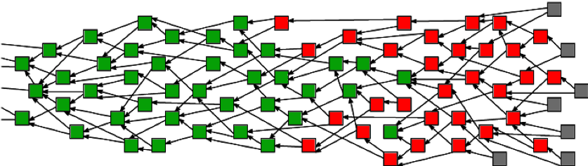

*“纠缠”示意图*

## 5 参考资料 (reference)
&nbsp;&nbsp;&nbsp;&nbsp;&nbsp;&nbsp;&nbsp;由于整理的时间与写作的时间相去一年，很多参考资料遗失或已忘记。因此下述只是部分参考资料，该列表会随时更新。

* Narayanan, A., Bonneau, J., Felten, E., Miller, A. & Goldfeder, S.: Bitcoin and Cryptocurrency Technologies: A Comprehensive Introduction.
* Nakamoto, S.: Bitcoin: A Peer-to-Peer Electronic Cash System.
* Buterin, V.: Ethereum: A Next-Generation Smart Contract and Decentralized Application Platform.
* Wood, G.: Ethereum: A Secure Decentralised Generalised Transaction Ledger: Byzantium Version.
* Popov, S.: The Tangle.

## 6 注记 (note)
<a name="myfootnote1">1</a>: 严格来讲应为“大多数参与者”，后文中出现的“全体成员”均为此意。

<a name="myfootnote2">2</a>: 曾经被使用的MD5哈希函数，科学家对其多年的研究后找到了两条本身不同但哈希值相同的字符串，因此这个函数现在已不再用于区块链。

<a name="myfootnote3">3</a>: 如果共识无法达成，那么区块链将永久分叉出两个子链，参与者在各自支持的链上继续制造新的区块。这就是区块链的“分叉”。

<a name="myfootnote4">4</a>: 严格来讲并非在这一时间段的所有数据均被记录其中，没有被记录的数据可等待被下一个区块记录。

<a name="myfootnote5">5</a>: 事实上，每一个试图制造区块的参与者通常在本地维护一个所有未被引用的交易输出的集合。当他需要确认某一条输入数据所引用的输出数据之前未被引用时，只需要检验这条输出数据是否在集合当中，而不需要遍历区块链查找。

<a name="myfootnote6">6</a>: 因为在一个分叉链上成功制造出区块已属不易，如果还要分割自己的算力同时延伸两条分叉链，那么制造出区块的可能性更小，这不是一个理性参与者的选择。

<a name="myfootnote7">7</a>: 当然，文中所述只是在理想情况下，参与者可以表示任何能用比特币脚本表示的条件。但实际上，如果条件过于“罕见”，当参与者把这条交易数据广播后，矿工拒绝记录这条交易数据的风险较大——因为他们担心包含“罕见”交易数据的区块被广播后有被他人拒绝认可的风险。事实上，当前比特币区块中绝大多数交易数据都是常规类型的比特币脚本。 

<a name="myfootnote8">8</a>: 在以太坊中，参与者进行的操作远不止转账以太币这一种类型，更可为参与者任何自定义的行为。但为了统一叙述，仍称为“交易”，不过这个“交易”的含义要从广义的角度理解。

<a name="myfootnote9">9</a>: 就像日常生活中支付一笔款项得到一条记录了这笔交易的具体内容的收据。交易收据记录了根据交易数据改变系统状态过程中的过程信息。

<a name="myfootnote10">10</a>: 更确切来讲是本地的以太坊虚拟机（Ethereum Virtual Machine）。

<a name="myfootnote11">11</a>: “智能合约”可以简单地理解为“智能的合约账户”。

<a name="myfootnote12">12</a>: 有人认为区块链2.0是区块链与智能合约的结合，是将区块链应用于更广阔的金融领域的尝试。而区块链3.0代表着区块链超出金融领域，为各行各业提供去中心化的解决方案。在笔者看来，这是从区块链的应用层面进行概念的划分，但从技术层面，2.0时代的以太坊已经拥有为各行各业提供去中心化的解决方案的可能。因此从技术层面，区块链3.0还未到来。